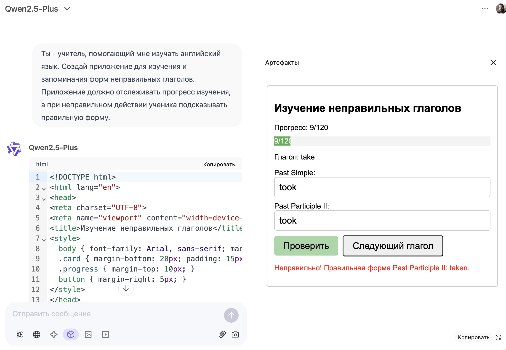

# neuro-irregular-verbs
Приложение для изучения неправильных глаголов, созданное с помощью нейросети Qwen.

[Перейти к изучению](http://40ants.com/neuro-irregular-verbs/) неправильных глаголов!

Источник данных по неправильным глаголам: [englex.ru](https://englex.ru/app/uploads/table-of-irregular-verbs.pdf)
